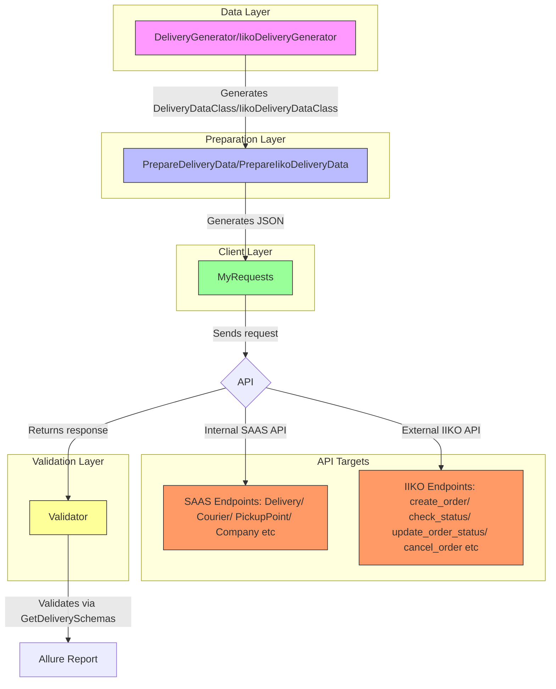

# Courierica Testing Framework
[](https://github.com/psf/black)

## Overview

Courierica Testing Framework is an API testing framework designed to automate testing for courier-related services. 
It supports end-to-end (E2E) testing, validation of API responses, and integration testing for various microservices.

This framework helps to:
* Ensure API stability and reliability
* Automate complex testing scenarios
* Save time and reduce costs by catching issues early
* Enable Continuous Integration (CI) and Continuous Deployment (CD)

## Project structure

### Project architecture



### System components

| Component  | Project Path | Purpose |
| ------------- | ------------- | ------------- |
| DeliveryGenerator | generator/delivery_generator.py | Generating data for SAAS orders |
| IikoDeliveryGenerator | generator/iiko_delivery_generator.py | Generating data for IIKO orders |
| PrepareDeliveryData | src/prepare_data/prepare_delivery_data.py, src/prepare_data/prepare_iiko_delivery_data.py | Preparing data for API |
| MyRequests | src/http_methods.py | Custom HTTP client (httpx wrapper) |
| Validator | src/validator.py | Validating responses with Pydantic |
| conftest.py | courierica_testing/conftest.py | Global pytest fixtures, setting up the environment |
| settings.py | courierica_testing/settings.py | Project configurations, environment variables |
| .env | courierica_testing/.env | Personal environment variables (not under git) |

# Technologies Used

* `Python 3.x` – Main programming language
* `pytest` – Testing framework
* `httpx` – Asynchronous HTTP client for API calls
* `pydantic` – Data validation and serialization
* `allure-pytest` – Test reporting
* `python-dotenv` – Environment variable management
* `Faker` – Fake data generation

# Getting Started

## Installation

Clone the repository:
``` bash
git clone https://github.com/YuryHerasimau/courierica_testing.git
cd courierica_testing
```

Create and activate a virtual environment:
``` bash
python -m venv env
source env/bin/activate  # On Windows: env\Scripts\activate
```

Install dependencies:
``` bash
pip install -r requirements.txt
```

## Running Tests

Run all tests (default: dev):
``` bash
pytest -s -v --alluredir=allure-results
```

Run tests for specific environment (e.g. prod):
``` bash
TEST_ENV=prod pytest -s -v --alluredir=allure-results # On Windows (PowerShell): $env:TEST_ENV="prod"; pytest -s -v
```

Run a specific test suite:
``` bash
pytest tests/test_company
```

Run a specific test:
``` bash
pytest -k test_multiple_deliveries_routing_flow
```

Run tests by marker (defined in pytest.ini):
```
# Run only smoke tests
pytest -m smoke

# Run only critical path tests (80% key functionality coverage)
pytest -m critical_path

# Run extended coverage tests (edge cases, negative tests)
pytest -m extended

# Run regression (full feature tests)
pytest -m regression

# Run integration tests
pytest -m integration

# Combine markers: run smoke OR critical_path
pytest -m "smoke or critical_path"

# Combine markers: run smoke AND NOT flaky
pytest -m "smoke and not flaky"
```

## Generate Allure Report

To generate the Allure report, you can use the following command:

```bash
allure generate allure-results -o allure-report --clean
```

After generating the report, you can view it by opening the index.html file in the [allure-report](allure-report) directory or by serving it with:

```bash
allure open allure-report
```

Alternatively, you can serve the report directly from the results directory using:

``` bash
allure serve allure-results
```
